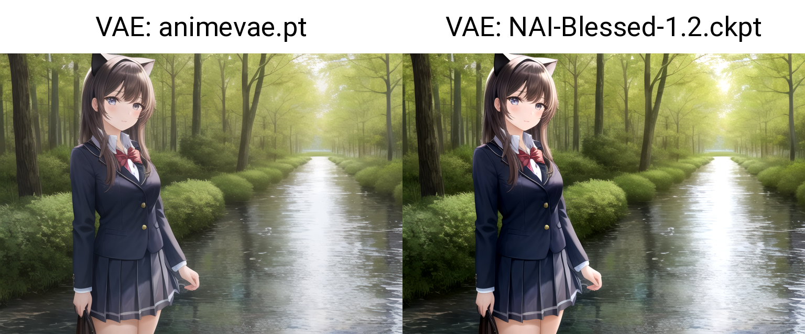
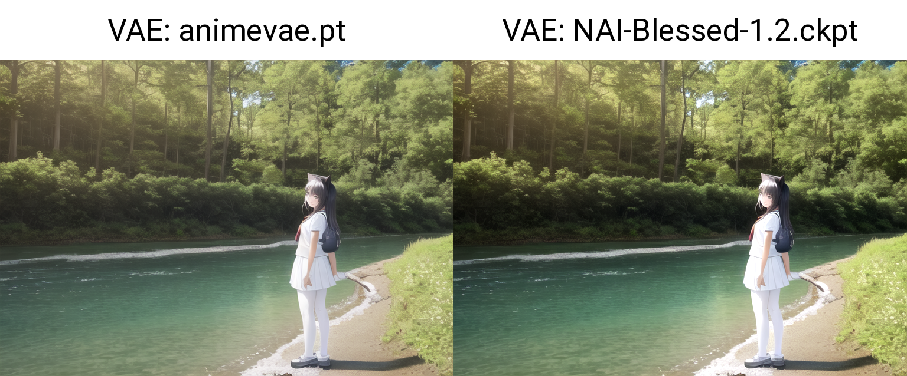
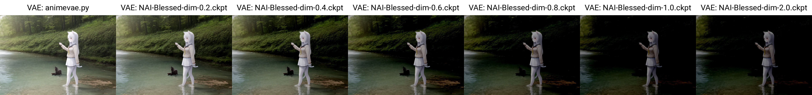

# Stable Diffusion VAE BlessUp 🙏

I noticed many people were having problems with low contrast VAEs while using
novelAI based models, and too high of contrast VAEs while using Waifu Diffusion based models.

People started to try to get in between by merging the VAEs, but if the only thing you are trying
to change is saturation or contrast, there are ways to keep your VAE optimal for your
model while still changing brightness and contrast.

## How it works

The output layer of the VAE is no longer latents but pixels. This means that we can do
the same types of math we do with normal images, but built into the last layer of the VAE.
You can think of whatever math you are doing as a post processing layer to the VAE, with no activation function.
However, when there is no activation function, the layers can just simply be combined.

```python
vae.decoder.conv_out.weight = nn.Parameter(vae.decoder.conv_out.weight * or + NUMBER)
vae.decoder.conv_out.bias = nn.Parameter(vae.decoder.conv_out.bias * or + NUMBER)
```

## How to use

Clone the repo and install requirements, then run `bless_vae.py`

Args:

  - --model_path: Path to your VAE
  - --model_type: Type of model you are using (compvis or diffusers)
  - --output_path: Path to save your VAE
  - --output_type: Type of model you want to save as (compvis or diffusers)
  - --contrast: Contrast number (optional)
  - --contrast_operation: Operation to use for contrast (mul or add)
  - --brightness: Brightness number (optional)
  - --brightness_operation: Operation to use for brightness (mul or add)
  - --patch_encoder: Apply inverse operation to encoder block of VAE (see below)

mul refers to multiplication of the weights or biases by the number

add refers to addition of the weights or biases by the number

## Patch Encoder
By default, we only are changing the output layer of the VAE.
This is fine for normal generations, but anything that uses the encoder block of the VAE,
(eg. hiresfix with an upscaler that doesn't use latents) will pass through our
changes twice. `--patch_encoder` tries to alleviate this issue by applying the inverse
operation to the first layer of the encoder. It seems to work well for hiresfix, however
if you are using img2img with a low denoising strength, it can cause loss of quality.
See [this github isue](https://github.com/sALTaccount/VAE-BlessUp/issues/1) for examples.

## Examples

### Raising Contrast (model is Anything v4.5, NAI Vae)



### Lowering Brightness (model is Anything v4.5, NAI Vae)

### Lowering Contrast (model is Waifu Diffusion 1.5, kl-f8-anime2 VAE)


# Download

I'm going to put a few example VAEs here:

https://drive.google.com/drive/folders/1x0O9n99JjbOy76yj9MpZU-LTJqswrglz?usp=sharing

### TODO
 - Upload VAEs
 - Per channel modification
 - GUI
